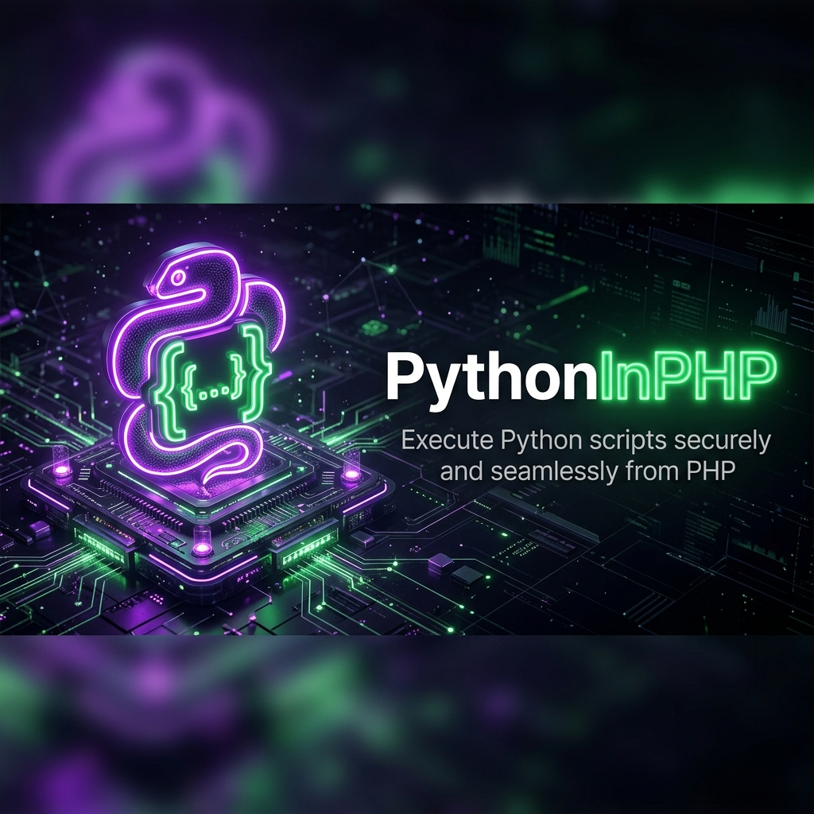

<p align="center">
  
</p>

<p align="center">
  <a href="https://packagist.org/packages/rakshitbharat/pythoninphp"></a>
  <a href="https://packagist.org/packages/rakshitbharat/pythoninphp"></a>
  <a href="https://github.com/rakshitbharat/pythoninphp/actions/workflows/tests.yml"></a>
  <a href="LICENSE.md"></a>
  <a href="https://php.net"></a>
  <a href="https://laravel.com"></a>
</p>

---

## 🌟 What is PythonInPHP?

**PythonInPHP** is a modern, lightweight Laravel integration wrapper that allows you to execute Python scripts securely and seamlessly from within your PHP applications. 

Rather than deploying complex microservices, using HTTP APIs, or running raw execution commands prone to security risks, PythonInPHP provides:
- **🔒 Secure Execution**: Utilizing Symfony's robust `Process` component instead of `exec()` or `popen()` to ensure proper argument escaping and prevent command injection.
- **⚡ Laravel Service Integration**: Native Laravel auto-discovery Service Provider, Facades, and dynamic configuration.
- **⏱️ Timeout Safety**: Prevent hanging processes via configurable timeouts.
- **🛠️ Testing Sandbox**: A complete Docker test-runner out of the box for platform-independent package testing.

---

## ✨ Features

- **Unified API**: Execute scripts using the clean `Python` Facade: `Python::run()`.
- **Argument Escaping**: Arguments are safely escaped and passed as an array.
- **Custom Exceptions**: Script runtime failures and timeouts throw a structured `PythonExecutionException`.
- **Configurable Runtime**: Easily define your Python binary path and default process timeouts in `config/pythoninphp.php`.
- **PHP 8.2+ & Laravel 10/11**: Fully built for modern PHP & Laravel stacks.

---

## 📦 Installation

Install the package via Composer:

```bash
composer require rakshitbharat/pythoninphp
```

Laravel's package auto-discovery will automatically register the `PythonServiceProvider` and the `Python` facade.

---

## ⚙️ Configuration

Publish the configuration file:

```bash
php artisan vendor:publish --tag="pythoninphp-config"
```

This will create a `config/pythoninphp.php` file:

```php
return [
    // Define the path to your Python executable
    'executable' => env('PYTHON_EXECUTABLE', 'python3'),

    // Default execution timeout in seconds (null for no timeout)
    'timeout' => env('PYTHON_TIMEOUT', 60),
];
```

---

## 🚀 Usage

### Simple Run
Run a Python script relative to your Laravel application's root directory (`base_path()`):

```php
use Rakshitbharat\Pythoninphp\Facades\Python;

$output = Python::run('app/Scripts/hello.py');
echo $output; // Prints standard output
```

### Passing Arguments
Arguments passed as an array are securely escaped:

```php
$output = Python::run('app/Scripts/process.py', [
    '--file=data.csv',
    '--verbose'
]);
```

### Error Handling
Script failures (non-zero exit codes) or execution timeouts throw a `PythonExecutionException`:

```php
use Rakshitbharat\Pythoninphp\Exceptions\PythonExecutionException;

try {
    $output = Python::run('app/Scripts/unreliable.py');
} catch (PythonExecutionException $e) {
    Log::error("Python script failed: " . $e->getMessage());
}
```

---

## 🧪 Local Testing

You can run the PHPUnit test suite locally within a clean, containerized PHP 8.2 environment using Docker:

```bash
# 1. Build and install dependencies
docker compose run --rm test-runner composer install

# 2. Run the tests
docker compose run --rm test-runner vendor/bin/phpunit
```

---

## 📄 License

The MIT License (MIT). Please see [LICENSE.md](LICENSE.md) for more information.
